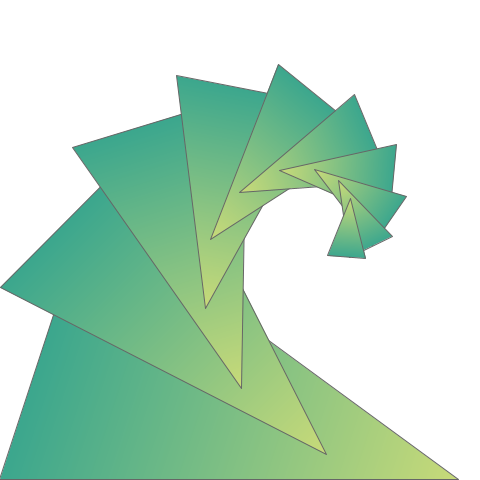

# Logo

The logo for the intent developer ecosystem is the "fractal fan."

It builds from a simple but meaningful shape: a balanced, golden-mean triangle. It suggests:

* An unfurling leaf

    Living systems and organic growth are a good examples for software. Nature is familiar, modest, and patient--yet superbly sophisticated, adaptive, and robust. Leaves energize ecosystems, scrub waste, signal stress, and feed and delight people.

* A recursive spiral

    Fractals cleanly encapsulate complexity and manifest patterns in terse, distilled formulas. They invite attention to detail, mathematical rigor, and science. They're beautiful at all levels.

* A wave

    The mindset and techniques embodied by intent are the wave of the future. Waves build and resonate.

* Iteration and progressive disclosure

    Software is best built in repeated cycles of refinement. Code should reveal the big picture before the details. Zero in on the target by continually adjusting.

* The iron triangle

    Scope-schedule-resources is an important constraint. We cannot escape it, but intent can shift our scale and perspective. 