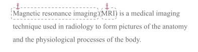
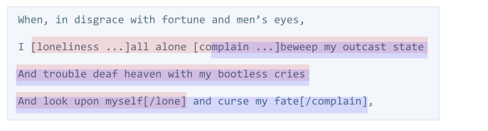
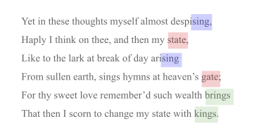

# Hypertext

Intent is a powerful hypertext format. It promotes what linguists call __deixis__ -- pointing with language.

Intent supports all of the linking constructs that HTML has popularized, plus some advanced features offered by word processors and desktop publishing software, plus some features that are unique.

## TL;DR

element | syntax
--- | ---
[hyperlink](#hyperlinks) | <code>[@ref&vert;clickable content]</code>. Advanced params can be added between `ref` and `clickable`, delimited by `;`
[simple text anchor](#simple-text-anchors) | `[anchor text]`
[text anchor with explicit id](#explicit-anchor-ids) | `[id: anchor text]`
[location anchor without content](#location-anchors) | `[id:]`
[code anchors](#code-anchors) | automatic from structure; referenced with dotted notation
[anchors for media and other complex content](#anchor-pairs) | `[id ...]`content`[/]`. Unlike HTML, overlapping anchors are supported.
[dijoint anchors](#disjoint-anchors) | `[id+:anchor text]` and/or `[id+ ...]`content`[/]` in any combination; only one needs to have `+` after the `id`

## Details
### Anchors

An anchor is a target for a hyperlink -- something we can point *at*. It may be a word or phrase, a location, a visual artifact, or any other type of intent content.

#### Simple text anchors

The most common thing to point at in intent is text, and the simplest way to anchor text is to enclose it in square brackets. For example, the following paragraph defines anchors around two terms, so they can be referenced elsewhere:

```i
[Magnetic resonance imaging] ([MRI]) is a medical imaging
technique used in radiology to form pictures of the anatomy
and the physiological processes of the body.
```

__Anchor text__ like "Magnetic resonance imaging" is intended to be displayed inline with the text that surrounds it -- probably un-stylized. Enclosing it in square brackets simply creates a region of the text that can be pointed to.



#### Anchor IDs

Each anchor defines an __anchor ID__. This is a short, memorable string that uniquely identifies the anchor within its container.

##### Implicit anchor IDs

The easiest way to define the ID of an anchor is to leave it implicit -- let it be calculated automatically from the anchor text itself. This is what happens with the simple square bracket notation in the MRI example above; the ID for "MRI" is "MRI", too. Or close enough. (See [Comparing anchor IDs below for more](#comparing-anchor-ids).)

##### Explicit anchor IDs

It is also possible to customize the ID for an anchor using a more verbose __explicit ID syntax__: `[id: anchor text]`. For example:

```i
The [ww2history: history of World War II] is long and complex.
```

##### Comparing anchor IDs

Whether anchor IDs are implicit or explicit, intent recognizes and compares them in a way that makes them convenient and robust for humans. Minor details are ignored: ID values are trimmed, converted to lower case, and have all runs of punctuation and/or spaces replaced with a single hyphen. This means that the anchor id `MRI` could also be written as `mri`. And this more complex example:

    He won't -- or shouldn't, anyway! -- say "Get lost."

...is the same as:

    he-won-t-or-shouldn-t-anyway-say-get-lost

The lower kabob-case form is canonical. However, variants of this ID that are just capitalized or punctuated differently will also be seen as equivalent.

In addition, *references* to long IDs can be abbreviated with an ellipsis, as long as the portion of the ID that remains is still unambiguous. In most containers, the long ID above could probably be referenced as `He won't...` or `... say 'Get lost'` or even `he...get-lost`.

#### Location anchors

Sometimes the intent is to anchor a location *inside* content, rather than anchoring content itself. For example, you might want to point between two words. To do this, simply insert an explicit anchor ID without any anchor text:

```i
running text[insert-here:] more running text
```

Note the lack of a space after "text". The anchor is for an insert point immediately after text. If we had instead written:

```i
running text [insert-here:] more running text
```

...the anchor would instead be between two spaces.

#### Code anchors

The structure of intent source code automatically creates anchors. All formally assigned identifiers (block headers that end in a colon and are followed by indented content) in intent are anchored to their place of definition. In this code:

```i
Register to vote: bool
    params:
        voter
        election
    code:
        # code goes here
```

...the name `Register to vote` is an anchor. So is `Register to vote.params` and `Register to vote.code`.

#### Advanced anchors

Pointing at a simple word or phrase is relatively easy -- but intent supports more sophisticated constructs as well.

##### Anchor pairs

When anchors encompass content that is non-textual, large, or complex, an __anchor pair__ is used. This is somewhat like a begin tag/end tag pair in HTML. The __anchor start__ contains the anchor ID followed by whitespace and an ellipsis, ` ...`. The __anchor end__ is another bracketed expression that contains the anchor ID preceded by slash:

```i
Sonnet 29 is a famous romantic poem by Shakespeare. 
It goes like this:

    [sonnet-29 ...]
    (all the text of the poem)
    [/sonnet]
```

The anchor end only needs enough of the ID from the anchor start to be unambiguous. Often, this could simplify all the way to:

```i
    [sonnet-29 ...]
    (all the text of the poem)
    [/]
```

##### Overlapping anchors

Unlike HTML, anchors in intent do not need to nest cleanly; they can overlap. The following is legal, but requires anchor pairs with at least partial IDs in the anchor ends to make the intent clear:



##### Disjoint anchors

Intent also supports anchors that encompass multiple, discontinuous stretches of content as a virtual unit. For example, suppose an English teacher wanted to illustrate the rhyme scheme in Shakespeare's sonnet. She might highlight the endings of multiple lines as part of a single disjoint anchor; when she later links to such an anchor, she can then point to the disconnected lines as a unit (e.g., the red lines here):



To define disjoint anchors in intent, use one of the anchor forms that [explicit ID syntax](#explicit-id-syntax) or  append a `+` char to at least one instance of the shared anchor ID. This can be done with simple anchor ID. As long as one instance of thebegins with a his corresponds to the following intent syntax:

```i
Yet in these thoughts myself almost desp[a+ising,
Haply I think on thee, and then my state,
Like to the lark at break of day arising
From sullen earth, sings hymns at heaven’s gate;
For thy sweet love remember’d such wealth brings
That then I scorn to change my state with kings.
```


### Hyperlinks

A hyperlink is an expression in the form `[@ref|clickable content]`, where `id` is optional and has the same semantics as with anchors (allowing a hyperlink to also be an anchor itself), `anchor` is a target bracketed elsewhere, and `clickable content` is the text or graphic that would be rendered as blue underlined text if the hyperlink were HTML. Additional params--`target` and `base`--can be added between `anchor` and `linked text` using `;` + whitespace, as in:

```i
[@https://www.example.com/a/b; target=_blank; rel=author|clickable text]
```

Hyperlinks to simple textual anchors can be shortened so they look like those anchors with an `@` in front of them. To refer to the MRI term from our example above, running text might contain the following hyperlink:

```i
You need to get an [@MRI] as soon as possible.
```  

Hyperlinks also support a paired variant that follows the same rules as anchors:

```i
[@https://a.b.com/c; target=_blank ...]clickable content[/] 
```

...or:

```i
[sample@https://a.b.com/c; target=_blank ...]clickcable content[/sample]
```

## Interjections

An interjection is a way of managing linked content where it is convenient to create and maintain it, but displaying it somewhere else. Interjections are intent's way of dealing with things like footnotes, endnotes, callouts, and similar collateral. In an editor, iterjections are defined inline: inside, next to, or near the content they enhance, in an editor. However, they may be rendered in an entirely different place, such as a footer, an appendix, etc.

An interjection may have one or more __display points__ where its content or some subset or transformation thereof is rendered. 

A display point for interjection is defined with an expression in the form `[^@id: anchor content]`, where `id` is a formal identifier for the interjection.

The interjected content (e.g., the text of a footnote, the diagram) is defined at a __definition point__. This may be an anchor in the form `[^id: interjected content]`, or a formally named block that has a type, marks, and other properties. In the latter case, the block should carry the `+interject` mark to indicate that it is not to be displayed as part of the running context.

Suppose you are using intent to write about some product requirements, and you want to add a footnote about . You might do it like this:

```i
We need to make sure that we consider accessibility. Some of our
customers [^@1: say] that they won't buy unless the product is
usable by the visually impaired.

[^1: See the focus group done in Sep 2019.]
```

You could also do it like this:

```i
We need to make sure that we consider accessibility. Some of our
customers [^@1: say] that they won't buy unless the product is
usable by the visually impaired.

^1: footnote
    See the focus group done in Sep 2019.
```


